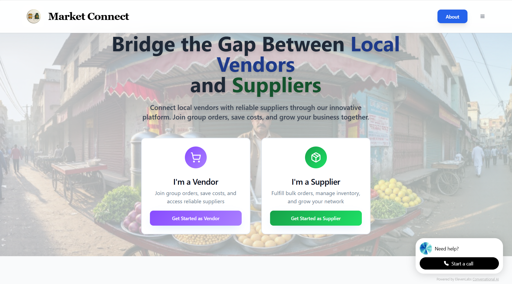

# MarketConnect 🛒

[](https://web-dev-code-champs-kappa.vercel.app/)
[](https://webdev-codechamps.onrender.com/)

MarketConnect is a comprehensive B2B platform build during Tutdude WebDev 48 - hour Hackathon that revolutionizes supply chain management by connecting suppliers and vendors through smart group purchasing and direct supplier connections. The platform enables efficient order management, product group creation, and streamlined payment processing.



---

## 🌟 Features

### For Suppliers 🏭
- **Dashboard Management**: Comprehensive supplier dashboard with analytics
- **Product Group Creation**: Create and manage product groups with pricing
- **Order Management**: Handle incoming orders from vendors
- **Location Services**: Set delivery areas and manage service locations
- **Profile Management**: Complete business profile setup with certifications

### For Vendors 🏪
- **Order Placement**: Browse suppliers and place individual or group orders
- **Group Purchasing**: Join group orders for better pricing
- **Order Tracking**: Real-time order status updates
- **Supplier Discovery**: Find suppliers based on location and products
- **Payment Integration**: Secure payment processing via Razorpay

### General Features ✨
- **Authentication**: Secure Firebase-based user authentication
- **Responsive Design**: Mobile-first, responsive UI/UX
- **Real-time Updates**: Live order status and notifications
- **Location Services**: GPS-based location detection and management
- **Payment Gateway**: Integrated Razorpay for secure transactions

---

## 🛠️ Tech Stack

### Frontend
- **Framework**: React 18 with TypeScript
- **Build Tool**: Vite
- **Styling**: Tailwind CSS + shadcn/ui components
- **State Management**: React Query (TanStack Query)
- **Routing**: React Router DOM
- **Authentication**: Firebase Auth
- **Maps**: Geolocation API
- **Payments**: Razorpay React SDK

### Backend
- **Runtime**: Node.js
- **Framework**: Express.js
- **Database**: SQLite (with planned migration to PostgreSQL)
- **Authentication**: Firebase Admin SDK
- **CORS**: Configured for multiple domains

### Deployment
- **Frontend**: Vercel
- **Backend**: Render
- **Domain**: Custom domain with SSL

---

## 🌐 Live Demo

- **🌍 Frontend Application**: [https://web-dev-code-champs-kappa.vercel.app/](https://web-dev-code-champs-kappa.vercel.app/)
- **🔗 Backend API**: [https://webdev-codechamps.onrender.com/api](https://webdev-codechamps.onrender.com/api)

### Demo Accounts
- **Supplier Demo**: Use the supplier registration flow
- **Vendor Demo**: Use the vendor registration flow

---

## 🚀 Getting Started

### Prerequisites
- Node.js (v16 or higher)
- npm or yarn
- Git

### 1. Clone the Repository
```bash
git clone https://github.com/DikshaP-2506/WebDev_CodeChamps.git
cd WebDev_CodeChamps
```

### 2. Backend Setup
```bash
cd Backend
npm install

# Create environment variables (if needed)
# The app uses SQLite by default, no additional DB setup required

# Start the backend server
npm start
```
The backend will run on `http://localhost:5000`

### 3. Frontend Setup
```bash
cd ../Frontend
npm install

# Create .env file with your environment variables
cp .env.example .env
# Edit .env with your configuration

# Start the development server
npm run dev
```
The frontend will run on `http://localhost:8080`

---

## ⚙️ Environment Variables

### Frontend (`.env`)
```env
# Razorpay Configuration
VITE_RAZORPAY_KEY_ID=rzp_test_your_key_id
VITE_RAZORPAY_KEY_SECRET=your_razorpay_secret

# API Configuration
VITE_API_BASE_URL=https://webdev-codechamps.onrender.com/api

# Environment
VITE_ENVIRONMENT=production
```

### Backend
The backend uses SQLite by default and doesn't require additional environment variables for basic functionality. For production deployment, you may want to configure:
- Database connection strings
- Firebase service account keys
- CORS origins
- Port configuration

---

## 📁 Project Structure

```
WebDev_CodeChamps/
├── Frontend/                    # React frontend application
│   ├── public/                 # Static assets
│   │   ├── logo.jpg           # Application logo
│   │   └── favicon.ico        # Favicon
│   ├── src/
│   │   ├── components/        # Reusable UI components
│   │   ├── pages/            # Page components
│   │   ├── services/         # API services
│   │   ├── contexts/         # React contexts
│   │   ├── hooks/            # Custom hooks
│   │   ├── lib/              # Utility libraries
│   │   └── utils/            # Helper functions
│   ├── package.json
│   └── vite.config.ts
├── Backend/                     # Express.js backend
│   ├── routes/               # API route handlers
│   ├── initialize-db.js      # Database initialization
│   ├── server.js            # Main server file
│   ├── vendors.db           # SQLite database
│   └── package.json
└── README.md
```

---

## 🔄 API Endpoints

### Suppliers
- `GET /api/suppliers` - Get all suppliers
- `POST /api/suppliers` - Create supplier profile
- `GET /api/suppliers/:id` - Get supplier by ID
- `PUT /api/suppliers/:id` - Update supplier profile

### Vendors
- `GET /api/vendors` - Get all vendors
- `POST /api/vendors` - Create vendor profile
- `GET /api/vendors/:id` - Get vendor by ID
- `PUT /api/vendors/:id` - Update vendor profile

### Product Groups
- `GET /api/product-groups` - Get all product groups
- `POST /api/product-groups` - Create product group
- `PATCH /api/product-groups/:id/status` - Update group status

### Orders
- `GET /api/orders` - Get all orders
- `POST /api/orders` - Create new order
- `PUT /api/orders/:id/status` - Update order status

---

## 🎨 UI/UX Features

- **Modern Design**: Clean, professional interface with consistent branding
- **Mobile Responsive**: Optimized for all device sizes
- **Loading States**: Skeleton loaders and progress indicators
- **Error Handling**: User-friendly error messages and fallbacks
- **Toast Notifications**: Real-time feedback for user actions

---

## 🔐 Security Features

- **Authentication**: Firebase Auth with email/password
- **Authorization**: Role-based access control (Supplier/Vendor)
- **Data Validation**: Input sanitization and validation
- **CORS Protection**: Configured CORS policies
- **Secure Payments**: PCI-compliant Razorpay integration

---

## 📱 Mobile Features

- **Progressive Web App**: PWA capabilities
- **Touch Optimized**: Mobile-friendly interactions
- **Offline Support**: Basic offline functionality
- **Location Services**: GPS-based location detection

---

## 🚀 Deployment

### Frontend (Vercel)
```bash
# Automatic deployment on push to main branch
# Environment variables configured in Vercel dashboard
```

### Backend (Render)
```bash
# Automatic deployment from GitHub
# Database persists across deployments
```
---


## 👥 Team

- **Development Team**: VESIT WebDev CodeChamps
- **Project Members**: 
  - [Diksha Patkar](https://github.com/DikshaP-2506)
  - [Sakshi Thorat](https://github.com/sakshithorat13)
  - [Pradnya Patil](https://github.com/Pradnya-2006)
  - [Harshal Bhave](https://github.com/bhave-harshal-3000)
  - [Chirag Vispute](https://github.com/chiragvispute)
- **Repository**: [WebDev_CodeChamps](https://github.com/DikshaP-2506/WebDev_CodeChamps)

---


## 🙏 Acknowledgments

- Thanks to all contributors who have helped shape MarketConnect
- Special thanks to Tutedude WebDev Hackathon Team

---
